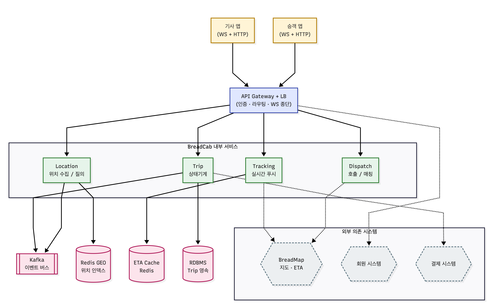

# Week 2 과제: 택시 호출 서비스 설계

## 1. 문제 이해 및 설계 범위 확정

### 시나리오

승객이 호출하면 주변 빈 택시를 찾아 매칭하고, 매칭된 택시가 픽업 지점에 도착할 때까지 승객은 택시 위치와 도착 예상 시간을 실시간으로 확인한다. 픽업 이후 목적지에 도착할 때까지 위치 추적이 이어진다.

> **컨셉: BreadCab (빵택시)** — 차량 내에서 갓 구운 빵과 커피를 무료 제공하는 차별화 택시 호출 서비스. 단, 본 설계의 차별화 요소는 호출/매칭/실시간 추적 흐름에 한정하며, 빵·커피 재고는 다루지 않는다.

### 설계 범위 (In / Out of Scope)

| 포함 (In Scope) | 제외 (Out of Scope) |
|---|---|
| 호출 시점부터 도착 완료 시점까지의 실시간 흐름 | 회원가입 · 인증 · 기사 등록 절차 |
| 기사·승객 위치 추적 | 이용 이력 |
| 매칭 로직 | 운행 종료 후 요금 산정 · 결제 · 리뷰 · 정산 |
| 이상 상황 처리 (앱 종료, 네트워크 단절, 취소 등) | 도로망 데이터 / 경로 탐색 알고리즘 |
| 수요 폭주 대응 | 빵·커피 재고/공급망 |

### 시스템 구성 전제

- 우리가 설계할 대상은 **오로지 택시 호출 서비스(BreadCab)** 이다.
- 외부 의존: **지도 시스템(BreadMap, 경로·ETA)**, **회원 시스템**, **결제 시스템**
- 기사·승객 모두 로그인 상태, 결제 수단 등록 완료 상태로 가정
- 외부 시스템 의존에서 오는 문제(지연, 장애, 응답 오류)는 **본 서비스가 책임진다**

### 기능 요구사항

- 기사 위치를 서버에 저장하고, 승객 호출 시 반경 내 빈 택시를 가까운 순으로 매칭
- 매칭 후 픽업 이동 중: 승객 화면에 택시 위치 + 픽업 지점까지 경로·ETA 실시간 표시
- 운행 중: 승객 화면에 현재 위치 + 목적지까지 경로·ETA 실시간 표시
- 이상 상황(앱 종료·네트워크 단절·호출 취소)에서 시스템이 일관된 상태 유지

### 비기능 요구사항 (시간 / 지연 목표)

| 항목 | 목표 |
|---|---|
| 호출 접수 응답 시간 | 호출 요청 → "기사 검색 중" 진입까지 **2초 이내** |
| 매칭 완료 시간 | 평균 **30초 이내**, 5분 초과 시 실패 처리 |
| 위치 추적 갱신 지연 | 기사 위치 변화 → 승객 화면 반영 평균 **5초 이내** |

### 개략적 규모 추정

| 항목 | 수치 | 도출 |
|---|---|---|
| 동시 운행 기사 | 10,000명 | 주어짐 |
| 일일 호출 수 | 500,000건 | 주어짐 |
| 평균 호출 RPS | ~6 RPS | 500,000 / 86,400 |
| **피크 호출 RPS** | **~30 RPS** | 평균 × 5 |
| 기사 위치 업데이트 RPS (대기 5초, 운행 2초 가정) | ~3,000 RPS | 대기 6,000명 × 1/5 + 운행 4,000명 × 1/2 ≈ 3,200 |
| 위치 데이터 저장 (Redis GEO) | ~1MB | 10,000 × ~100B |
| 활성 WebSocket 커넥션 | ~30,000 | 기사 10,000 + 호출 진행 중 승객 ~20,000 |

### 본인이 추가로 둔 가정

- **단일 대도시권 = 서울권 (반경 ~30km, 면적 ~2,800㎢)** 으로 가정
- 위치 업데이트는 **최신값만 유효** — 손실 허용 (5초 안에 다음 값이 또 오므로)
- 매칭/결제 같은 트랜잭션성 메시지는 **손실 불허** — at-least-once 보장
- 기사 1명당 동시 호출 제안은 **1건만** 가능 (멀티 제안 시 race 조건 복잡)

---

## 2. 개략적 설계안 제시 및 동의 구하기

### 핵심 흐름

BreadCab의 라이프사이클은 크게 4단계로 나눈다.

1. **위치 보고 (Location Reporting)** — 기사 앱이 주기적으로 자신의 GPS 좌표를 서버에 전송. 상태(대기/운행)에 따라 주기 다름.
2. **호출 & 매칭 (Dispatch & Matching)** — 승객이 호출 → 서버가 반경 내 빈 택시 검색 → 가까운 순으로 제안 → 첫 수락자와 매칭 성립.
3. **픽업 추적 (Pickup Tracking)** — 매칭된 기사 위치를 승객에게 실시간 푸시. 경로·ETA를 외부 지도에서 받아 캐싱해서 전달.
4. **운행 & 종료 (Trip & Completion)** — 픽업 완료 → 목적지까지 추적 동일 방식 → 도착 처리. (요금·결제는 out of scope)

### 개략적 아키텍처 다이어그램



```
┌─────────────┐                              ┌─────────────┐
│   승객 앱    │                              │   기사 앱    │
│ WS + HTTP   │                              │  WS + HTTP   │
└──────┬──────┘                              └──────┬──────┘
       │                                            │
       └──────────────┐              ┌──────────────┘
                      ▼              ▼
              ┌─────────────────────────────┐
              │     API Gateway + LB        │
              └──────────────┬──────────────┘
                             │
       ┌──────────┬──────────┼──────────┬──────────┐
       ▼          ▼          ▼          ▼          ▼
  ┌─────────┐┌─────────┐┌─────────┐┌─────────┐
  │Dispatch ││Location ││Tracking ││  Trip   │
  │호출/매칭││위치 수집││실시간   ││상태기계 │
  │         ││  /질의  ││  푸시   ││         │
  └────┬────┘└────┬────┘└────┬────┘└────┬────┘
       │          │          │          │
       ▼          ▼          ▼          ▼
  ┌─────────┐┌─────────┐┌─────────┐┌─────────┐
  │Redis GEO││  Kafka  ││ RDBMS   ││ETA 캐시 │
  │위치인덱스││이벤트   ││Trip영속 ││ Redis   │
  └─────────┘└─────────┘└─────────┘└─────────┘
       △            △            △
       │            │            │
       (외부 의존 — 점선)
       │            │            │
  ┌─────────┐┌─────────┐┌─────────┐
  │BreadMap ││회원 시스템││결제 시스템│
  │지도·ETA ││  외부   ││  외부   │
  └─────────┘└─────────┘└─────────┘
```

**컴포넌트 책임 요약**

- **API Gateway + LB**: 인증 토큰 검증(회원 시스템 연계), 요청 라우팅, WebSocket 연결 종단
- **Location 서비스**: 기사 위치 수신 → Redis GEO에 upsert, 반경 질의 응답
- **Dispatch 서비스**: 호출 접수 → Location 서비스에 후보 질의 → 매칭 제안 라운드 진행
- **Tracking 서비스**: 매칭된 호출에 대해 기사 위치를 승객에게 푸시, ETA 캐시 조회
- **Trip 서비스**: 호출 라이프사이클의 단일 진실(상태기계) 보관, 영속화
- **Kafka**: 컴포넌트 간 비동기 이벤트(위치, 상태 변화, 매칭) 전달
- **RDBMS**: Trip 상태, 매칭 이력 등 영속 필요한 데이터

---

## 3. 상세 설계

### 우선순위

8가지 고민 질문 중 BreadCab의 핵심 특성과 비기능 요구사항을 가장 직접 결정하는 **3-1 (위치 업데이트 주기), 3-2 (위치 저장), 3-5 (매칭 전략), 3-8 (수요 폭주)** 네 가지를 깊이 다루고, 나머지는 핵심 결정을 보조하는 수준으로 정리한다.

---

### 3-1. 기사 위치 업데이트 주기 

**상태별 차등 주기**가 핵심 아이디어다. 모든 기사를 동일 주기로 보고하게 하면 트래픽이 낭비된다.

```
[오프라인] --로그인--> [대기 5초] --호출 도달--> [매칭 제안 3초]
                         ▲              │
                         │              │ 수락
                         │              ▼
              하차 완료  │       [픽업 이동 2초] --픽업--> [운행 2초]
                         └────────────────────────────────┘
```

**상태별 주기 설계 근거**

| 상태 | 주기 | 근거 |
|---|---|---|
| 대기 | **5초** | "반경 내 빈 택시" 검색용. 5초 사이 이동 ≤ 약 70m(시속 50km 기준) → 매칭 후보 정확도 충분 |
| 매칭 제안 중 | 3초 | 매칭 직전이라 좀 더 정밀 |
| 픽업/운행 | **2초** | 승객 화면 갱신 지연 5초 이내 충족(2초 보고 + 전송 지연 여유) |

**산출 부하**

- 대기 6,000명 × 1/5 + 운행 4,000명 × 1/2 ≈ **3,200 RPS** (피크 시간엔 약 1.5~2배)
- 대기 주기를 5초 → 1초로 통일하면 약 10,000 RPS로 3배 증가 → **차등 주기로 약 70% 절감**

**손실 허용**: 5초 안에 다음 보고가 또 오므로 단건 손실 OK → 클라이언트 fire-and-forget, 서버는 **last-write-wins** 적용.

---

### 3-2. 기사 위치 저장 — 어디에, 어떤 형태로? 

#### 저장소 후보 비교

| 후보 | 쓰기 RPS | 반경 질의 | 단점 |
|---|---|---|---|
| PostGIS | ~수백 | 강력(R-tree) | 디스크 IO, 1만 RPS는 부담 |
| Geohash + Redis | 매우 빠름 | 직접 구현 필요 | 경계 박스 처리 복잡 |
| **Redis GEO** | **매우 빠름(인메모리)** | **GEOSEARCH 내장** | 영속성 약함 |
| Elasticsearch geo_point | 빠름 | 강력 | 오버킬 |

**선택: Redis GEO**

- 쓰기 ~3,200 RPS, 반경 질의 ~30 RPS 정도는 단일 Redis 인스턴스도 처리 가능
- 데이터셋이 작음(1만 × 약 100B = **1MB**) → 메모리 부담 0
- 위치는 휘발성이어도 무방(클라이언트가 또 보내므로) → 영속성 약점 무관

#### 자료 구조

```
# Redis GEO 키
GEO drivers:available     (driver_id → lon, lat)   ← 대기 상태만 색인
GEO drivers:on_trip       (driver_id → lon, lat)   ← 운행 중 (다른 호출 매칭에서 제외)

# 부가 정보 (Hash)
HASH driver:{id}  state, last_seen_ts, vehicle_type, current_trip_id, ...
```

핵심: **대기 중인 기사만 매칭 검색 인덱스에 둔다.** 매칭 시점에 한 번 더 상태 검증으로 race를 막는다.

#### 반경 질의

```
GEOSEARCH drivers:available
  FROMLONLAT 127.027 37.498
  BYRADIUS 3 km ASC
  COUNT 10 ANY
```

#### 샤딩

단일 도시권에서는 1만 기사라 샤딩 불필요. 다도시 확장 시 **도시 단위 키 prefix**(`drivers:available:seoul`)로 자연 분할.

#### 쓰기 부하 vs 읽기 부하

- **쓰기**: 위치 update 3,000~6,000 RPS — Redis GEO `GEOADD` 단일 명령
- **읽기**: 매칭 호출 시점만 — 피크 30 RPS × 1~3회 = **100 RPS 미만**
- **결론: 압도적으로 쓰기 우위** → 쓰기 비용 최적화(파이프라인, 한 커넥션에 다수 요청 묶기)에 집중

---

### 3-3. 검색 반경과 결과 처리

| 단계 | 반경 | 정책 |
|---|---|---|
| 1차 | 2km | 가장 가까운 5명에게 순차 제안 |
| 2차 (10초 후 후보 부족) | 5km | 추가 후보 합쳐 제안 |
| 3차 (60초 후) | 8km | 마지막 시도 |
| 5분 초과 | — | 호출 실패 처리, 승객에게 안내 |

**0건 처리**: 첫 1차에서 0건이면 곧장 2차 반경으로 확장. 8km에서도 0건이면 "근처에 빈 택시가 없습니다, 대기열에 등록할까요?" 옵션 제공.

**지역 밀도 차이**: 강남/홍대처럼 밀집 지역은 1차 반경 1km로 줄여서 더 정밀하게, 외곽은 1차부터 5km로 시작 — 지역별 기본 반경 테이블을 운영 데이터로 튜닝.

---

### 3-4. 위치·경로·ETA 전달

| 구간 | 프로토콜 | 이유 |
|---|---|---|
| 기사 → 서버 (위치) | **MQTT 또는 WebSocket (binary)** | 한 방향 다발 전송, 손실 허용, 절전 |
| 서버 → 승객 (위치/ETA) | **WebSocket** | 양방향, 신뢰 메시지 가능, 모바일 친화 |
| 호출/매칭/취소 같은 트랜잭션 | **HTTP** | idempotency key로 재시도 보장 |

**ETA 계산 전달 흐름**

1. 기사 위치가 Location 서비스에 들어오면 Kafka에 `driver_location_updated` 발행
2. Tracking 서비스가 매칭된 호출 단위로 구독, 최신 위치 + 캐시된 경로로 ETA 갱신
3. WebSocket으로 승객에게 push (delta만)

**ETA 캐시**: 외부 BreadMap 호출을 줄이기 위해 **출발지·도착지·시간대 조합 키**로 5초 TTL 캐시. 같은 호출 안에서는 5초마다 한 번씩만 외부 호출.

---

### 3-5. 매칭 대상 선정 

**순차 제안 + 짧은 제한시간** 방식을 선택한다.

```
[호출 접수] → Trip 생성, 잠금
     │
     ▼
[후보 검색] → Redis GEO 가까운 순 5명
     │
     ▼
┌────────────────────────────────────────┐
│ 1순위 기사 제안 (최대 8초 대기)         │
│   거절/타임아웃 ↓                        │
│ 2순위 기사 제안 (8초 대기)              │
│   거절/타임아웃 ↓                        │
│ N순위... 반복                            │
└─────────────────┬──────────────────────┘
                  │ 수락
                  ▼
         [매칭 확정 — CAS 원자 갱신]
                  │
                  ▼
            [픽업 추적 시작]
```

**왜 순차 제안인가**

- **동시 제안**의 문제: 5명에게 동시에 띄우면 보통 1~2명만 누르고 나머진 무시 → 거절이 잦은 기사가 불이익 받기 어려움. 또 **동시 수락 race 처리**에 분산 락 필요 → 복잡도↑
- **순차 제안**: 한 명에게 8초 → 거절/타임아웃 → 다음. 8초 × 5명 = 40초로 30초 목표에 약간 빠듯하지만, 첫 제안에서 보통 끝나므로 평균은 충분히 빠름
- 동시 수락 race가 원천 차단됨 (한 번에 한 명만 제안 받음)

**"가까운"의 기준**

- 1차: **직선거리(Redis GEO 기본)** 로 후보 5명을 뽑음 — 빠름
- 2차: 후보 5명에 대해서만 BreadMap에 **도로 거리·ETA** 일괄 질의 → 진짜 가까운 순으로 재정렬
- 외부 호출은 매칭당 1회로 제한 (캐싱 효과 약하므로 비용으로 받아들임)

**동시 수락 방어 (만약 동시 제안 정책으로 바꿀 경우)**

```sql
-- Trip 레코드의 driver_id를 CAS로 갱신
UPDATE trips SET driver_id = ?, state = 'MATCHED'
WHERE trip_id = ? AND driver_id IS NULL
```

`UPDATE`가 0건이면 이미 다른 기사에게 매칭된 것 → 해당 기사에게 "이미 다른 기사가 수락했습니다" 응답.

---

### 3-6. 이상 상황 처리

**기사 측 판단 — 3-1의 보고 주기와 직결**

| 상태 | 보고 주기 | 끊김 판정 |
|---|---|---|
| 대기 | 5초 | **15초** 동안 보고 없으면 "오프라인" → 매칭 인덱스에서 제거 |
| 매칭 제안 중 | 3초 | **10초** 무응답 시 자동 거절, 다음 후보로 |
| 픽업/운행 | 2초 | **10초** 끊김 → 승객에게 "기사 연결 중" 표시, **30초** 초과 → 운영 알림 + 자동 재배차 옵션 |

**Heartbeat = 위치 보고** 자체. 별도 ping 채널 두지 않음(불필요).

**승객 측**

- 호출 취소: 상태별 정책 — `SEARCHING` 단계는 자유 취소, `MATCHED`(기사가 픽업 향해 출발) 후엔 취소 수수료 안내(요금 시스템 연동)
- 앱 종료: WebSocket 끊김 → 서버 측 상태는 유지하되, 재접속 시 현재 호출 상태 동기화

**일관성 보장**

- Trip의 상태기계는 **단일 진실(Trip 서비스 + RDBMS)** — 다른 서비스는 상태 변경 시 Trip 서비스에 요청
- 모든 상태 변화는 Kafka로 이벤트 발행 → 후속 서비스(알림, 정산 등) 비동기 수신

---

### 3-7. 외부 지도·경로 의존 관리

- **누가**: Dispatch(후보 ETA 재정렬), Tracking(픽업/운행 중 ETA 갱신)
- **언제·얼마나**:
  - Dispatch: 매칭당 1회
  - Tracking: 매칭된 호출당 5초마다 1회 → 동시 진행 호출 5,000건 가정 시 약 **1,000 RPS**
- **캐싱**: `(출발 격자 50m, 도착 격자 50m, 5분 단위 시간대)` 키로 ETA 5초 캐시 → 캐시 히트율 30~50% 기대
- **장애 대응**:
  - **타임아웃 200ms**, 실패 시 **마지막 성공한 ETA + 경과 시간으로 추정**(클라이언트에 stale 표시)
  - **Circuit breaker** — 연속 실패 시 30초 차단, 캐시·추정으로만 응답
  - 매칭 단계에서 외부 장애 시: 직선거리만으로 매칭 계속 진행 (서비스 가용성 우선)

---

### 3-8. 수요 폭주 예측 시 대응 

> 예: **잠실 주경기장 아이유 콘서트 종료 직후 30분 내 2만 건 호출**

**기술적 대응**

1. **사전 워밍업 (T-30분)**
   - Dispatch / Tracking 서비스 인스턴스 **수동 스케일아웃** (auto-scaling은 반응이 늦음)
   - Redis 커넥션 풀 사전 확장
   - 외부 BreadMap에 사전 협의 RPS 증량 요청
2. **지오펜스 기반 호출 큐**
   - 잠실 인근에 **가상 지오펜스** 설정 → 해당 구역 호출은 별도 우선순위 큐(`dispatch:zone:jamsil`)로 라우팅
   - 일반 호출 큐와 분리해 폭주가 시 전체 영향을 차단
3. **반경·제안 정책 동적 조정**
   - 해당 시간/구역만 1차 반경 1km → 3km로 확장 (더 많은 기사 후보)
   - 제안 대기시간 8초 → 5초로 단축
4. **백프레셔**
   - 큐 길이 임계 초과 시, 신규 호출에 "혼잡, 예상 매칭 N분" 안내 후 큐에 등록 → 거절보다 명시적 대기

**정책·운영 대응**

| 대응 | 내용 |
|---|---|
| **기사 사전 배치 인센티브** | T-1시간부터 잠실권 진입 기사에게 콘서트 종료 시점 보너스 알림 |
| **수요 분산** | 인근 지하철역까지 1km 정도 걸어가면 할인 쿠폰 (앱 안내) |
| **호출 우선순위** | 동행 인원이 많은 호출, 거리가 먼 호출(긴 운행) 우선 매칭 |
| **운영 모니터링** | 콘서트 종료 직후 30분간 SRE 온콜, 대시보드 별도 표시 |

**예측 시그널 소스**: 행사 캘린더(공연/스포츠), 과거 동일 행사 패턴, 실시간 호출 증가율(분당 +30% 이상 시 자동 경보)

---

## 4. 설계 장점

- **상태별 차등 보고 주기**로 위치 트래픽을 70% 절감 — 핵심 자원(Redis, 네트워크)에 여유 확보
- **Redis GEO + 영속성 분리** — 빠른 변동(위치)은 인메모리, 느린 영속(Trip)은 RDBMS로 깔끔히 분리
- **순차 매칭**으로 동시 수락 race 원천 차단 — 분산 락 없이도 일관성 보장
- **CAS 기반 상태 전이**로 Trip의 단일 진실 보장
- **외부 시스템 장애에 fallback**(캐시·추정·직선거리) — 외부 의존이 가용성 직접 결정하지 않음
- **수요 폭주 사전 대응**(지오펜스 큐·인센티브)이 기술/운영 양쪽에 걸쳐 있어 효과가 큼

---

## 5. 설계 단점

- **순차 제안 8초 × 5명 = 40초**라 매칭이 늦은 케이스에서 30초 목표를 못 맞출 수 있음 → 첫 후보가 거절 잦은 지역에선 동시 제안 하이브리드 필요
- **Redis GEO 단일 인스턴스**는 단일 도시권 가정 — 멀티 도시 확장 시 샤딩/클러스터 재설계 필요
- **외부 BreadMap 의존도** 가 운행 추적에서 여전히 큼 — 캐싱이 잘 맞지 않는 운행(긴 거리, 잦은 경로 변경)에선 비용·지연이 큼
- 위치 보고를 **fire-and-forget**으로 한 만큼 가끔 발생하는 손실이 후속 매칭에서 잘못된 후보를 뽑는 경우가 있을 수 있음 (last-write-wins로 자연 복구되지만 짧은 순간 부정확)

---

## 6. 마무리

### 개인적 의견

이번 설계에서 가장 흥미로웠던 트레이드오프는 **위치 보고 주기**였다. "5초마다 보고"라는 한 줄 결정이 곧바로 Redis 쓰기 RPS, 매칭 정확도, 배터리 소모, 그리고 이상 상황 판정 기준 모두를 좌우한다. 시스템 설계에서 비기능 요구사항(여기선 "위치 갱신 5초 이내")이 데이터 모델까지 끌어내리는 좋은 예시였다.

또, **동시 vs 순차** 매칭은 단순한 속도 비교가 아니라 race 처리 복잡도 · 기사 거절률 · UX 일관성을 함께 보는 트레이드오프였다. 본 설계에선 race를 원천 차단하고 구현 복잡도를 낮추기 위해 순차를 기본값으로 골랐지만, 실제 Uber · Lyft 등 대형 서비스는 동시 broadcast + 원자적 락 조합을 더 자주 쓴다. 분산 매칭 큐(hash ring 기반 샤딩)는 멀티 도시로 확장할 때 추가로 살펴볼 주제다.

---

## 📚 참고 자료

- 《가상 면접 사례로 배우는 대규모 시스템 설계 기초》 — 9장(뉴스피드)의 캐시·푸시 구조, 부록 격으로 다뤄지는 위치 기반 서비스 패턴
- Redis 공식 문서 — GEO commands (`GEOADD`, `GEOSEARCH`)
- Uber Engineering Blog — H3, Marketplace Matching
- 카카오모빌리티 기술 블로그 — 배차 시스템, 수요예측
