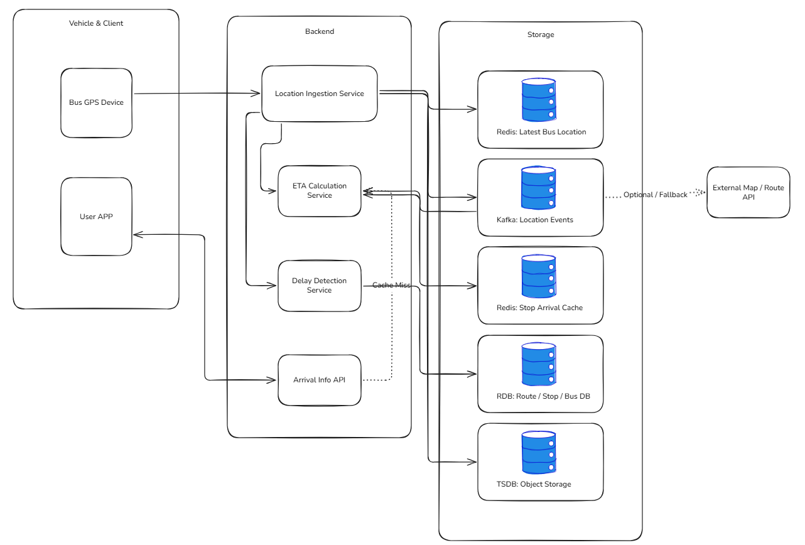

## 1. 문제 이해 및 설계 범위 확정

### 시나리오

버스는 운행 중 일정 주기로 자신의 GPS 위치, 속도, 방향, 혼잡도, 운행 상태를 서버에 전송한다. 서버는 수집된 위치 정보를 기반으로 각 정류장별 버스 도착 예정 시간, 현재 버스 위치, 운행 지연 여부를 계산한다.

사용자는 앱에서 특정 정류장을 검색하거나 즐겨찾기한 정류장을 조회한다. 사용자가 정류장을 선택하면 해당 정류장에 도착 예정인 버스 목록, 예상 도착 시간, 현재 위치, 남은 정류장 수, 혼잡도 정보를 실시간에 가깝게 확인할 수 있다.

이 시스템은 택시 호출처럼 승객과 차량을 매칭하지 않는다. 대신 **대량의 차량 위치 업데이트를 수집하고, 훨씬 더 많은 사용자 조회 요청을 빠르게 처리하는 것**이 핵심이다.

---

### 설계 범위

| 포함                  | 제외                 |
| ------------------- | ------------------ |
| 버스 GPS 위치 수집        | 회원가입 · 인증          |
| 정류장별 도착 예정 시간 계산    | 결제 · 교통카드 연동       |
| 사용자 앱에 실시간 도착 정보 제공 | 버스 노선 신설/변경 관리 시스템 |
| 버스 혼잡도 표시           | 실제 버스 운행 스케줄 편성    |
| 운행 지연 감지            | 도로망 데이터 구축         |
| 위치 갱신 지연 및 단절 처리    | 기사/운수사 내부 관리 시스템   |

---

### 시스템 구성 전제

* 대상은 단일 대도시권의 버스 실시간 도착 정보 서비스이다.
* 버스 단말기는 GPS 위치, 속도, 방향, 혼잡도, 운행 상태를 주기적으로 서버에 전송한다.
* 사용자는 앱에서 정류장 또는 노선을 조회한다.
* 외부 지도 시스템은 정류장 위치, 도로 기반 거리, 기본 경로 정보를 제공한다고 가정한다.
* 다만 매 요청마다 외부 지도 API를 호출하지 않고, 자체 캐시와 사전 계산 데이터를 적극 활용한다.
* 버스 위치 정보는 약간의 지연이나 일부 유실이 허용된다.
* 하지만 사용자에게 오래된 정보를 최신 정보처럼 보여주면 안 되므로, 데이터 freshness를 명확히 관리한다.

---

### 기능 요구사항

* 버스 단말기는 주기적으로 현재 위치와 운행 상태를 서버에 전송한다.
* 서버는 버스별 최신 위치를 저장한다.
* 서버는 정류장별 도착 예정 버스 목록과 ETA를 계산한다.
* 사용자는 특정 정류장을 조회해 도착 예정 버스 목록을 확인할 수 있다.
* 사용자는 특정 버스 노선을 조회해 버스들의 현재 위치를 확인할 수 있다.
* 사용자 앱은 도착 예정 시간, 남은 정류장 수, 혼잡도, 지연 여부를 표시한다.
* 위치 업데이트가 일정 시간 이상 수신되지 않으면 해당 버스를 “정보 갱신 지연” 상태로 표시한다.
* 버스가 경로를 벗어나거나 장시간 정지하면 운행 지연 상태로 표시한다.

---

### 비기능 요구사항

| 항목                 | 목표                   |
| ------------------ | -------------------- |
| 정류장 도착 정보 조회 응답 시간 | 평균 500ms 이내          |
| 인기 정류장 조회 응답 시간    | 평균 200ms 이내          |
| 버스 위치 갱신 주기        | 평균 5초                |
| 사용자 화면 반영 지연       | 평균 5~10초 이내          |
| 위치 데이터 freshness   | 15초 이상 갱신 없음 시 지연 표시 |
| 피크 시간 조회 트래픽       | 평시 대비 5배 이상 처리       |
| 외부 지도 API 장애       | 캐시 기반 fallback 제공    |

---

### 개략적 규모 추정

| 항목            |                              수치 |
| ------------- | ------------------------------: |
| 서비스 지역        |                         단일 대도시권 |
| 일일 사용자 수      |                      2,000,000명 |
| 피크 동시 접속자     |                        300,000명 |
| 등록 버스 수       |                         20,000대 |
| 동시 운행 버스 수    |                         10,000대 |
| 정류장 수         |                         15,000개 |
| 버스 위치 업데이트 주기 |                              5초 |
| 위치 업데이트 처리량   |                    약 2,000건/sec |
| 일일 정류장 조회 수   |                     30,000,000건 |
| 피크 시간 조회 집중도  |                     평균 대비 5~10배 |
| 피크 시간대        | 출근 07:00–09:00 / 퇴근 18:00–20:00 |

---

### 본인이 추가로 둔 가정

* 실시간 버스 위치는 정확한 좌표보다 **정류장 기준 ETA**가 더 중요하다.
* 모든 사용자에게 매번 새로 ETA를 계산하지 않는다.
* 정류장별 도착 정보는 짧은 TTL을 가진 캐시로 제공한다.
* 버스 위치 업데이트는 일부 유실되어도 다음 업데이트로 복구 가능하다.
* 사용자의 조회 요청은 읽기 트래픽이 매우 크므로 캐싱과 fan-out 구조가 중요하다.
* 버스의 실제 운행 제어는 본 시스템의 범위가 아니다.

---

## 2. 개략적 설계안 제시 및 동의 구하기

### 핵심 흐름

1. 버스 단말기가 5초 주기로 위치, 속도, 방향, 혼잡도, 운행 상태를 서버에 전송한다.
2. Location Ingestion Service가 위치 데이터를 수신한다.
3. 최신 버스 위치는 Redis에 저장한다.
4. 위치 이벤트는 Kafka로 발행한다.
5. ETA Calculation Service가 위치 이벤트를 소비해 정류장별 ETA를 계산한다.
6. 계산된 정류장별 도착 정보는 Redis Cache에 저장한다.
7. 사용자가 특정 정류장을 조회하면 API 서버는 우선 Redis Cache에서 도착 정보를 조회한다.
8. 캐시가 없거나 오래된 경우 ETA Service에 재계산을 요청한다.
9. 사용자 앱은 HTTP polling 또는 WebSocket/SSE를 통해 정류장 정보를 주기적으로 갱신한다.
10. 위치 업데이트가 오래 들어오지 않은 버스는 “정보 갱신 지연” 상태로 표시한다.

---

## 3. 상세 설계

### 설계 대상 컴포넌트 사이의 우선순위

이 시스템에서 중요한 컴포넌트는 다음 순서로 본다.

### 1. Location Ingestion Service

버스 단말기에서 들어오는 GPS 데이터를 안정적으로 수집하는 컴포넌트이다.

이 서비스는 초당 수천 건 이상의 위치 업데이트를 처리해야 한다. 위치 정보는 최신성이 중요하기 때문에 모든 위치를 강한 트랜잭션으로 저장하지 않고, 최신 위치는 Redis에 overwrite한다.

---

### 2. ETA Calculation Service

버스 위치를 기반으로 정류장별 도착 예정 시간을 계산한다.

이 시스템의 핵심 비즈니스 로직이다. 사용자가 실제로 원하는 것은 버스의 위도·경도가 아니라, “몇 분 뒤에 이 정류장에 도착하는가”이다.

---

### 3. Arrival Info API

사용자 앱의 정류장 조회 요청을 처리한다.

읽기 트래픽이 매우 많으므로 매번 DB나 ETA 계산 서비스를 직접 호출하지 않는다. 대부분의 요청은 Redis Cache에서 응답한다.

---

### 4. Redis Cache Layer

인기 정류장의 도착 정보를 빠르게 응답하기 위한 핵심 컴포넌트이다.

출근 시간의 강남역, 잠실역, 서울역 같은 정류장은 조회 요청이 매우 많이 몰린다. 이런 정류장은 짧은 TTL의 캐시를 두고 반복 계산을 줄인다.

---

### 5. Delay Detection Service

버스의 위치 갱신 지연, 장시간 정지, 경로 이탈을 감지한다.

사용자에게 단순 ETA만 보여주는 것이 아니라, “정보 갱신 지연”, “운행 지연 가능성” 같은 상태를 함께 표시한다.

---

### 상세 아키텍처 다이어그램


---

## 3-1. 버스 위치 업데이트 주기

버스 상태에 따라 위치 업데이트 주기를 다르게 둔다.

| 버스 상태      | 업데이트 주기 | 이유                  |
| ---------- | ------: | ------------------- |
| 정상 운행 중    |      5초 | 실시간 도착 정보 제공에 충분    |
| 정류장 접근 중   |    2~3초 | 도착 직전 ETA 정확도 향상    |
| 정류장 정차 중   |      5초 | 위치 변화가 크지 않음        |
| 차고지 / 운행 전 |  30초 이상 | 사용자 도착 정보와 직접 관련 낮음 |
| 운행 종료      | 업데이트 없음 | 조회 대상 제외            |
| 통신 불안정     |  재전송 시도 | 마지막 위치 기반 표시        |

업데이트 주기를 너무 짧게 잡으면 서버 쓰기 부하가 커진다. 반대로 너무 길면 사용자가 보는 ETA가 자주 어긋난다. 따라서 기본은 5초로 두고, 정류장 근처에서는 더 짧게 가져간다.

버스 위치 정보는 일부 유실되어도 다음 업데이트로 회복 가능하다. 따라서 위치 데이터는 “모든 이벤트를 반드시 저장”하기보다 “최신 상태를 빠르게 반영”하는 방향으로 처리한다.

---

## 3-2. 버스 위치 저장 — 어디에, 어떤 형태로?

버스 위치는 목적에 따라 저장소를 분리한다.

| 데이터        | 저장소                              | 목적               |
| ---------- | -------------------------------- | ---------------- |
| 버스 최신 위치   | Redis                            | 현재 위치 조회, ETA 계산 |
| 정류장별 도착 정보 | Redis Cache                      | 사용자 조회 응답        |
| 노선/정류장 정보  | RDB                              | 기준 데이터 관리        |
| 위치 이벤트 로그  | Kafka                            | 비동기 처리           |
| 위치 이력      | Time-series DB 또는 Object Storage | 분석, 지연 패턴 분석     |

최신 위치는 다음과 같이 저장한다.

```text
bus:location:{bus_id}
- latitude
- longitude
- speed
- heading
- route_id
- next_stop_id
- congestion_level
- updated_at
```

정류장별 도착 정보는 다음과 같이 저장한다.

```text
stop:arrival:{stop_id}
[
  {
    route_id: "143",
    bus_id: "bus-10291",
    eta_seconds: 180,
    remaining_stops: 2,
    congestion_level: "HIGH",
    status: "NORMAL",
    updated_at: "2026-05-12T08:10:05"
  },
  {
    route_id: "3412",
    bus_id: "bus-88102",
    eta_seconds: 420,
    remaining_stops: 5,
    congestion_level: "LOW",
    status: "DELAYED",
    updated_at: "2026-05-12T08:10:05"
  }
]
```

이 구조의 핵심은 사용자 요청 시마다 ETA를 계산하지 않는 것이다. ETA는 백그라운드에서 계속 계산해 Redis Cache에 저장하고, 사용자 요청은 이 캐시를 빠르게 읽는다.

---

## 3-3. 정류장 조회와 결과 처리

사용자가 정류장을 조회하면 다음 순서로 처리한다.

1. `stop_id` 기준으로 Redis Cache 조회
2. 캐시가 있고 freshness가 유효하면 즉시 반환
3. 캐시가 없거나 오래되면 ETA Calculation Service에 재계산 요청
4. 재계산이 오래 걸리면 마지막 계산 결과와 “정보 갱신 지연” 표시
5. 해당 정류장에 도착 예정 버스가 없으면 “도착 예정 버스 없음” 표시

캐시 TTL은 짧게 둔다.

| 정류장 유형 |    TTL |
| ------ | -----: |
| 인기 정류장 |   3~5초 |
| 일반 정류장 |  5~10초 |
| 외곽 정류장 | 10~15초 |
| 심야 시간대 | 10~20초 |

인기 정류장은 조회 트래픽이 많기 때문에 캐시 적중률이 중요하다. 반면 외곽 정류장은 조회 빈도가 낮고 버스 간격도 길기 때문에 TTL을 조금 길게 둬도 사용자 경험에 큰 문제가 없다.

---

## 3-4. 위치 · ETA 전달 / 갱신 방식

### 버스 → 서버

버스 단말기는 서버에 주기적으로 위치를 전송한다.

* 프로토콜: HTTP 또는 MQTT
* 주기: 기본 5초
* 데이터: 위치, 속도, 방향, 노선 ID, 혼잡도, 단말기 상태
* 처리 방식: 최신 위치 Redis 저장 + Kafka 이벤트 발행

위치 업데이트는 일부 유실되어도 된다. 최신 위치가 중요하므로 동일 버스의 위치는 계속 overwrite한다.

---

### 서버 → 사용자 앱

사용자 앱에 정보를 전달하는 방식은 두 가지로 나눌 수 있다.

#### 기본 방식: HTTP Polling

대부분의 사용자는 정류장 도착 정보를 몇 초 단위로만 확인하면 된다. 따라서 기본적으로는 5~10초 주기의 HTTP polling으로 충분하다.

장점:

* 구현이 단순하다.
* 서버 연결 관리 부담이 적다.
* 모바일 네트워크 환경에서 안정적이다.

#### 선택 방식: WebSocket 또는 SSE

사용자가 특정 버스를 지도에서 계속 추적하거나, “곧 도착” 상태를 보고 있을 때는 WebSocket 또는 SSE를 사용할 수 있다.

장점:

* 화면 반영 지연을 줄일 수 있다.
* 정류장 도착 직전의 실시간성을 높일 수 있다.

이 설계에서는 기본 조회는 HTTP polling, 상세 추적 화면은 WebSocket/SSE를 사용하는 하이브리드 방식을 선택한다.

---

## 3-5. ETA 계산 전략

ETA는 단순 직선거리로 계산하지 않는다. 버스는 정해진 노선을 따라 이동하므로, 정류장 순서와 노선 정보를 기준으로 계산한다.

ETA 계산에는 다음 정보를 사용한다.

* 현재 버스 위치
* 현재 속도
* 다음 정류장
* 남은 정류장 수
* 노선별 평균 구간 이동 시간
* 시간대별 교통 패턴
* 최근 위치 업데이트 지연 여부
* 정류장 정차 시간

ETA 계산 방식은 다음과 같이 단순화할 수 있다.

```text
ETA = 현재 위치에서 다음 정류장까지 예상 시간
    + 이후 정류장 구간별 평균 이동 시간
    + 정류장별 평균 정차 시간
```

매번 외부 지도 API를 호출하지 않고, 노선별 구간 평균 시간을 미리 계산해둔다. 외부 지도 API는 노선 변경, 도로 통제, 큰 지연 상황 등 특별한 경우에만 사용한다.

---

## 3-6. 이상 상황 판단 · 처리

### 버스 위치 업데이트 지연

| 상황       | 판단 기준           | 처리                     |
| -------- | --------------- | ---------------------- |
| 정상       | 최근 10초 이내 위치 수신 | 정상 ETA 표시              |
| 갱신 지연    | 15초 이상 위치 미수신   | “정보 갱신 지연” 표시          |
| 통신 단절 의심 | 30초 이상 위치 미수신   | ETA 신뢰도 낮음 표시          |
| 운행 제외    | 2분 이상 위치 미수신    | 도착 예정 목록에서 제외 또는 별도 표시 |

사용자에게 오래된 ETA를 최신 정보처럼 보여주는 것은 위험하다. 따라서 ETA와 함께 `updated_at`과 상태를 관리해야 한다.

---

### 장시간 정지

버스가 일정 시간 이상 같은 위치에 머무르면 지연 가능성으로 판단한다.

| 상황        | 판단 기준               | 처리            |
| --------- | ------------------- | ------------- |
| 정류장 정차    | 정류장 근처에서 1~2분 정지    | 정상            |
| 도로 정체 가능성 | 정류장 외 구간에서 3분 이상 정지 | 지연 가능성 표시     |
| 운행 중단 의심  | 10분 이상 이동 없음        | 도착 정보에서 제외 검토 |

---

### 경로 이탈

버스 위치가 해당 노선의 경로에서 일정 거리 이상 벗어나면 경로 이탈로 판단한다.

처리 방식:

* 일시적 GPS 오차인지 확인
* 일정 횟수 이상 반복되면 경로 이탈 상태 표시
* 해당 버스의 ETA 계산 신뢰도 낮춤
* 필요 시 운영 시스템에 알림

---

## 3-7. 외부 지도 / 경로 서비스 의존 관리

외부 지도 시스템은 다음 상황에서 사용한다.

| 사용 시점             | 목적            |
| ----------------- | ------------- |
| 노선/정류장 기준 데이터 초기화 | 정류장 좌표, 경로 보정 |
| 노선 변경 시           | 경로 데이터 갱신     |
| 비정상 지연 발생 시       | 도로 상황 반영      |
| ETA 보정 필요 시       | 기존 평균값 보정     |

하지만 모든 위치 업데이트마다 지도 API를 호출하지 않는다.

그 이유는 다음과 같다.

* 위치 업데이트 수가 많아 비용이 커진다.
* 외부 API 지연이 전체 시스템 지연으로 전파된다.
* 버스는 정해진 노선을 따라 움직이므로 내부 기준 데이터로도 대부분 계산 가능하다.

따라서 기본 ETA는 내부 노선 데이터와 최근 이동 패턴으로 계산하고, 외부 지도 API는 보정용으로만 사용한다.

지도 API 장애 시 fallback은 다음과 같다.

* 마지막 정상 ETA 유지
* 노선별 평균 구간 시간 기반 ETA 제공
* 사용자에게 “교통 정보 반영 지연” 표시
* 외부 API 장애가 길어지면 캐시 TTL을 늘려 시스템 부하 완화

---

## 3-8. 수요 폭주 예측 시 대응

예시 상황: 폭우가 내리는 퇴근 시간, 강남역과 잠실역 주변 정류장 조회가 급증하는 경우

### 시스템 대응

* 인기 정류장 도착 정보 사전 계산
* Redis Cache TTL 조정
* Arrival Info API auto scaling
* CDN 또는 Edge Cache를 통한 정적 노선 정보 제공
* 정류장별 요청 rate limiting
* WebSocket 사용 범위 제한
* Kafka consumer scale-out으로 ETA 계산 지연 방지

### 서비스 정책 대응

* 너무 잦은 새로고침 제한
* “마지막 갱신 시각” 명확히 표시
* 지연 발생 시 사용자에게 안내 문구 표시
* 인기 정류장은 앱 첫 화면에서 사전 로딩
* 장애 시 정류장별 상세 정보보다 핵심 도착 정보 우선 제공

수요 폭주 상황에서 중요한 것은 모든 정보를 완벽하게 제공하는 것이 아니라, 사용자가 가장 필요로 하는 **도착 예정 시간과 데이터 신뢰도**를 안정적으로 제공하는 것이다.

---

## 4. 설계 장점

* 사용자 조회 요청 대부분을 Redis Cache에서 처리해 읽기 트래픽에 강하다.
* 위치 업데이트와 사용자 조회 경로를 분리해 시스템 부하를 낮출 수 있다.
* ETA를 요청 시점마다 계산하지 않고 백그라운드에서 미리 계산해 응답 시간을 줄인다.
* 외부 지도 API 의존을 줄여 비용과 장애 전파 가능성을 낮춘다.
* 버스 위치 데이터와 정류장 도착 정보에 freshness를 두어 오래된 정보를 구분할 수 있다.
* HTTP polling과 WebSocket/SSE를 혼합해 실시간성과 운영 복잡도 사이의 균형을 맞춘다.
* 인기 정류장과 일반 정류장의 TTL을 다르게 두어 캐시 효율을 높인다.

---

## 5. 설계 단점

* Redis Cache 의존도가 높아 캐시 장애 시 사용자 조회 성능이 크게 떨어질 수 있다.
* ETA 계산 정확도는 위치 데이터 품질과 노선 데이터 정확도에 크게 의존한다.
* GPS 오차가 큰 지역에서는 버스 위치와 정류장 도착 판단이 부정확할 수 있다.
* HTTP polling 방식은 단순하지만, 사용자가 많아지면 반복 요청으로 인한 트래픽이 커질 수 있다.
* WebSocket/SSE를 확대 적용하면 연결 관리 비용이 증가한다.
* 외부 지도 API 장애 시 fallback ETA는 정확도가 낮아질 수 있다.
* 버스 단말기 장애와 실제 운행 중단을 구분하기 어렵다.

---

## 6. 마무리

이번 설계에서는 대중교통 실시간 도착 정보 시스템을 대상으로, 버스 위치 수집부터 정류장별 ETA 계산, 사용자 앱 조회까지의 흐름을 설계했다.

이 시스템의 핵심은 매칭이 아니라 **대량의 읽기 트래픽을 어떻게 안정적으로 처리할 것인가**이다. 버스 위치 업데이트는 초당 수천 건 수준이지만, 사용자의 정류장 조회 요청은 그보다 훨씬 많을 수 있다. 따라서 사용자 요청마다 ETA를 계산하는 구조가 아니라, 위치 이벤트를 기반으로 정류장별 도착 정보를 미리 계산하고 캐시에 저장하는 구조가 적합하다고 판단했다.

또한 실시간 시스템이라고 해서 모든 정보를 매 순간 정확하게 계산할 필요는 없다. 사용자에게 중요한 것은 “버스가 언제 도착하는지”와 “그 정보가 얼마나 최신인지”이다. 따라서 ETA 값뿐만 아니라 마지막 갱신 시각, 정보 갱신 지연 여부, 운행 지연 상태를 함께 제공해야 한다.

---

### 개인적 의견 / 사례 공유 / 추가 학습

이 설계를 하면서 가장 중요하다고 느낀 부분은 **실시간 위치 데이터와 사용자 조회 데이터를 분리하는 것**이다.

버스 GPS 데이터는 계속 들어오는 쓰기 중심 데이터이고, 정류장 도착 정보는 사용자가 반복해서 조회하는 읽기 중심 데이터이다. 두 흐름을 같은 방식으로 처리하면 시스템이 쉽게 복잡해진다.

그래서 위치 업데이트는 Redis와 Kafka를 통해 빠르게 수집하고, 정류장별 ETA는 별도로 계산해 Redis Cache에 저장하는 구조가 적절하다고 보았다. 사용자는 계산된 결과를 빠르게 조회하고, 백엔드는 위치 이벤트를 기반으로 계속 최신 도착 정보를 갱신한다.

추가로 이 시스템은 택시 호출 서비스와 달리 매칭 상태 머신은 약하지만, 캐싱, fan-out, 데이터 freshness, 외부 API 의존 관리 같은 대규모 실시간 시스템의 핵심 문제를 다루기 좋다고 느꼈다.

---

## 📚 참고 자료

https://inseon.tistory.com/59

https://grow-space.io/blog/rtls-3/

https://tech.kakao.com/posts/436

https://architecture101.blog/2023/08/19/design_a_geo-spatial_index_3/

---
