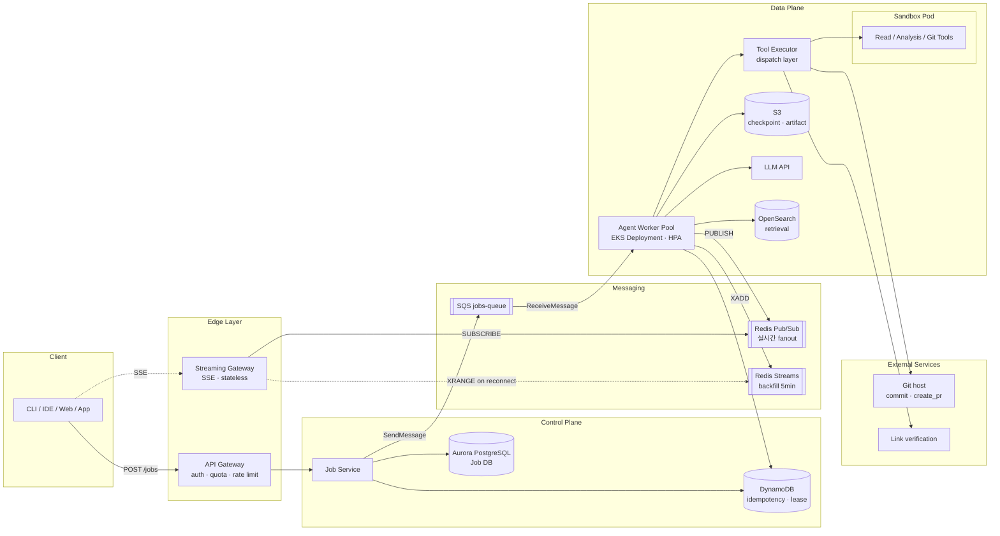
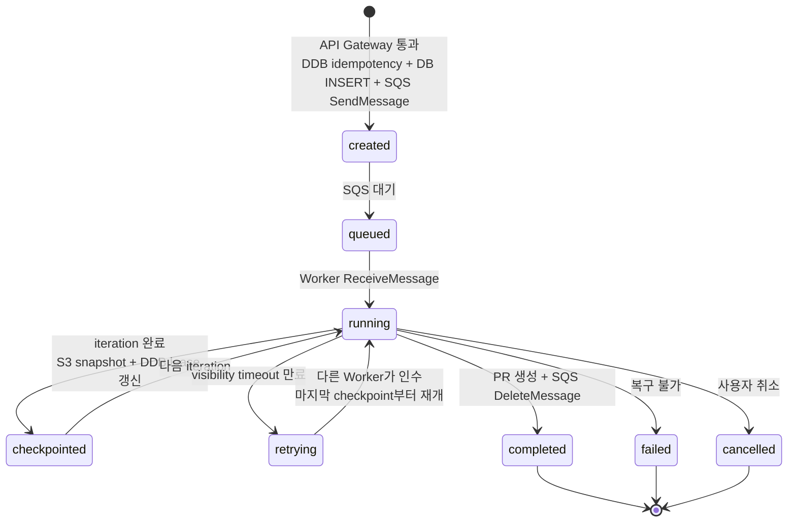
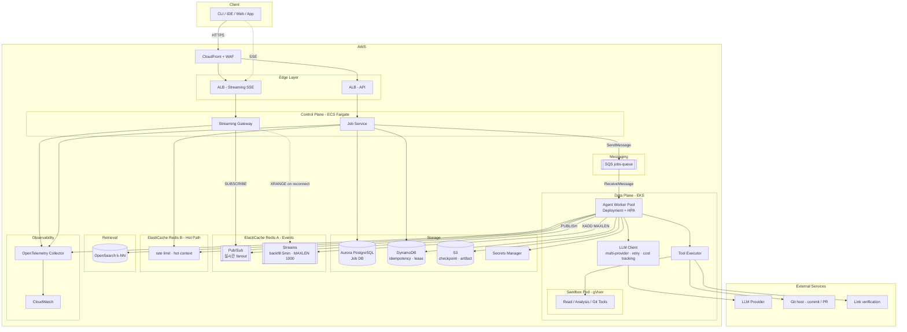

# Week 3 과제: AI 서비스 및 Agent 도구 시스템 설계

#### ⒈ 문제 이해 및 설계 범위 확정

**과제 시나리오**

- 사용자가 AI 코딩 Agent에게 자연어로 작업을 요청하면 AI는 텍스트 응답만 생성하는 것이 아니라 프로젝트 파일 탐색, 코드 수정, 명령 실행, 테스트 수행, 결과 검증 등의 tool들을 호출하며 작업을 수행한다.

    예를 들어:

    ```
    - "Docker 실행 오류 수정해줘"
    - "Redis 연결 실패 원인 분석해줘"
    - "테스트 코드 작성하고 실행해줘"
    - "이 프로젝트 구조 설명해줘"
    ```

    와 같은 요청에 대해 AI Agent는 여러 tool들을 순차적으로 호출하며 작업을 진행한다. 사용자는 작업 진행 상황과 로그를 실시간으로 확인할 수 있어야 하며 긴 작업 도중 연결이 끊겨도 상태가 유지되어야 한다.

**구체화한 시나리오**

- `AI 기술 문서 생성 Agent`
- 사용자가 자연어로 문서 생성을 요청하면 Agent가 Git 레포, 코드, OpenAPI 스펙, 커밋 로그 등을 분석하여 README, API 레퍼런스, 아키텍처 다이어그램, 릴리즈 노트를 생성·갱신한다.
- Agent는 파일 탐색, AST 파싱, Git 조회, 다이어그램 생성, 링크 검증 등의 Tool을 순차적으로 호출하며 작업을 수행한다.
- 대규모 레포 전체 문서화는 수십 분이 소요될 수 있으며, 사용자는 단계별 진행 상황과 섹션별 부분 결과를 실시간으로 확인할 수 있고 연결이 끊겨도 작업이 이어진다.

---

## 설계 범위 (In / Out of Scope)

| 포함 (In Scope) | 제외 (Out of Scope) |
| --- | --- |
| 사용자 요청 처리 흐름 | LLM 자체 학습 |
| Agent 실행 흐름 | 모델 파인튜닝 |
| Tool Calling 구조 | GPU 인프라 |
| 파일 탐색 / 코드 분석 | Transformer 구조 |
| 문서 생성 / 결과 검증 | 벡터 모델 구현 |
| 스트리밍 응답 | 문서 호스팅 플랫폼 구현 |
| 장시간 작업 처리 | 실제 컨테이너 런타임 구현 |
| 작업 상태 관리 | 운영체제 구현 |
| Sandbox / 권한 제어 | 완전한 보안 솔루션 개발 |
| 실패 복구 및 재시도 | 자체 LLM 개발 |

---

## 시스템 구성 전제

- 외부 LLM API(OpenAI, Anthropic 등)를 사용
- Tool 실행용 Sandbox는 이미 준비되어 있다고 가정
- 사용자는 로그인 상태
- Git Repository 및 외부 데이터 소스(OpenAPI 스펙, 이슈 트래커)는 접근 가능
- AI 서비스는 Tool orchestration과 상태 관리를 책임진다

---

## 기능 요구사항

- 사용자의 자연어 요청을 처리할 수 있어야 한다
    - 자연어 요청을 문서 생성 작업 단위(대상 레포, 문서 타입, 범위)로 변환
- AI Agent는 상황에 따라 여러 Tool을 호출할 수 있어야 한다
    - 파일 탐색(`list_files`, `read_file`, `grep`)
    - 코드 분석(AST 파싱, 함수/클래스 시그니처 추출)
    - Git 조회(`git log`, `git diff`, `git blame`)
    - 외부 데이터(OpenAPI 스펙 파싱, 이슈 트래커 조회)
    - 문서 생성(마크다운 작성, Mermaid/PlantUML 다이어그램)
    - 검증(링크 체크, 코드 예제 실행)
    - 퍼블리싱(docs/ 디렉토리 commit/PR)
- Tool 실행 결과를 기반으로 추가 작업을 수행할 수 있어야 한다
- 작업 진행 상황을 사용자에게 실시간 스트리밍할 수 있어야 한다
- 긴 작업을 비동기로 처리할 수 있어야 한다
- 작업 실패 시 재시도 또는 복구가 가능해야 한다
- 여러 사용자의 동시 작업을 처리할 수 있어야 한다
    - 동일 (사용자, 레포, 커밋 SHA, doc_type) 조합 중복 실행 방지(idempotency)
- Tool 실행 권한 범위를 제한할 수 있어야 한다

---

## 비기능 요구사항

| 항목 | 목표 |
| --- | --- |
| 첫 응답 시작 시간 | 3초 이내 |
| 스트리밍 지연 | 평균 1초 이하 |
| Tool 실행 실패 복구 | 자동 재시도 가능 |
| 장시간 작업 처리 | 최대 수십 분 |
| 작업 상태 복구 | 서버 재시작 또는 클라이언트 reconnect 후에도 작업 재개 가능 |
| 동시 실행 작업 수 | 수천 개 이상 |
| Agent 응답 일관성 | 동일 작업 중복 실행 방지 |

---

## 대략적 규모 추정

| 항목 | 수치 |
| --- | --- |
| MAU / DAU | 약 500,000명 / 약 100,000명 |
| 일일 Agent 작업 수 | 약 300,000건 |
| 평균 Tool 호출 횟수 | 작업당 10~100회 |
| 평균 작업 시간 | 1분 ~ 10분 |
| 장시간 작업 비율 | 약 10% (레포 전체 문서화, 최대 30분) |
| 동시 실행 작업 수 | 약 5,000건 |
| 평균 스트리밍 연결 유지 시간 | 약 2~10분 |
| 피크 트래픽 패턴 | PR 머지/릴리즈 직후 burst, CI 트리거 동시 유입 |
| LLM 토큰 사용량 | 작업당 평균 50K~500K tokens |

---

# 2. 개략적 설계안 제시

## 핵심 흐름

- 사용자가 클라이언트(CLI / IDE 확장 / 웹 / 앱)에서 자연어 요청을 보내면 API Gateway가 인증·quota·rate limit을 검사한 뒤 Job Service로 라우팅한다.
- Job Service는 idempotency key(`hash(user_id, repo, commit_sha, doc_type)`)를 DynamoDB에 conditional write(`PutItem with attribute_not_exists`)로 등록한다. 이미 존재하면 기존 job_id를 반환하고 종료. 신규면 Job을 Aurora PostgreSQL에 INSERT하고 SQS `jobs-queue`에 SendMessage. 클라이언트에 Job ID를 즉시 반환.
- 클라이언트는 Job ID로 Streaming Gateway에 SSE 연결을 맺는다. Streaming Gateway는 stateless이며 ElastiCache Redis Pub/Sub `job:{id}:events` 채널을 SUBSCRIBE해 실시간 이벤트를 SSE로 fanout한다. 재연결 시 `Last-Event-ID` 헤더가 있으면 Redis Streams `job:{id}:backfill`을 XRANGE로 누락분 backfill 후 Pub/Sub으로 전환.
- Agent Worker(EKS Deployment)가 SQS `jobs-queue`에서 ReceiveMessage(long polling, visibility timeout 5분)로 Job을 픽업한다. visibility timeout이 lease 역할을 하며, Worker는 heartbeat마다 ChangeMessageVisibility로 연장.
- Sandbox Pod를 생성하면서 init container가 대상 레포를 emptyDir 볼륨에 shallow clone하고 main container가 read-only로 mount. Agent Loop는 Worker에서 실행되며 Tool 호출을 통해 Sandbox 내부 파일에 접근한다.
- Agent Loop는 LLM 추론 → Tool 호출 결정 → Tool Executor 실행 → 결과 context append 사이클을 완료 조건까지 반복. Tool은 Worker 내부 Tool Executor가 dispatch:
    - **Sandbox 내부 실행**: 파일 탐색(`read_file`, `grep`), 코드 분석(`parse_ast`, `extract_signatures`), Git 조회(`git_log`, `git_diff`)
    - **Worker 프로세스 내 실행**: 섹션 생성(`write_section`), 다이어그램 렌더링(`render_mermaid`)
    - **외부 API 호출**: 링크 검증(`check_links`), PR 생성(`commit`, `create_pr`)
- 각 iteration 종료 시 S3에 context snapshot, DynamoDB에 lease/iteration 메타 저장.
- 이벤트 발행은 Worker가 Redis Pub/Sub `PUBLISH job:{id}:events`와 Redis Streams `XADD job:{id}:backfill MAXLEN ~ 1000`을 동시에 호출. Pub/Sub은 실시간 전달, Streams는 재연결 backfill 전용(5분 retention).
- Worker가 죽거나 heartbeat가 누락되면 SQS visibility timeout 만료로 메시지가 다시 가시화되고 다른 Worker가 ReceiveMessage로 인수해 마지막 S3 checkpoint부터 재개.
- 모든 섹션 완성 후 링크 검증·시그니처 검증을 통과하면 대상 레포에 commit/PR을 생성하고 Job 상태를 completed로 전이, 최종 이벤트를 발행 후 SQS DeleteMessage.

---

## 개략적 아키텍처 다이어그램



### Job 상태 전이



---

# 3. 상세 설계

## 컴포넌트별 AWS 서비스 선택

| 컴포넌트 | AWS 서비스 | 선택 이유 |
|---------|-----------|----------|
| API Gateway | ALB + ECS Fargate | SSE 호환 위해 ALB. API Gateway HTTP API는 SSE 지원 제약 |
| Streaming Gateway | ALB + ECS Fargate (Go) | SSE long-lived connection에 ALB가 적합, Go의 goroutine으로 동시 연결 효율적 |
| Job Service | ECS Fargate | stateless API |
| Job DB | Aurora PostgreSQL | Job 메타 영구 저장, multi-AZ HA |
| Idempotency + Lease | DynamoDB | conditional write로 SETNX 대체, TTL 자동 만료, multi-AZ durable |
| Job Queue | SQS Standard | durable, visibility timeout으로 lease 내장, multi-AZ default, pay-per-use |
| Event 실시간 fanout | ElastiCache Redis Pub/Sub (전용 클러스터 A) | fire-and-forget으로 CPU 부하 최소 |
| Event backfill | ElastiCache Redis Streams (전용 클러스터 A, 5min retention) | 재연결 시에만 사용, MAXLEN으로 메모리 압박 차단 |
| Rate limit + Hot context | ElastiCache Redis (전용 클러스터 B) | latency-critical, 손실 허용, event 부하와 격리 |
| Agent Worker | EKS | HPA, gVisor 통합 |
| Sandbox | EKS Pod (gVisor runtimeClass) | 강한 격리, Job 단위 폐기 |
| Checkpoint Store | S3 | iteration 단위 context snapshot, 30일 retention |
| Vector DB | OpenSearch (k-NN) | retrieval 인덱스 |
| Secret 관리 | Secrets Manager | LLM API key, Git token |
| Observability | CloudWatch + OpenTelemetry Collector | trace, metric, log 통합 |
| CDN | CloudFront + WAF | 정적 리소스, edge 방어 |

### 아키텍처 다이어그램



---

## 3-1. Agent 실행 흐름 관리

#### Agent loop를 어떻게 설계할 것인가?

**Agent loop**: ReAct 패턴 기반 think-act-observe 루프.

```
while not done and iteration < max_iterations:
    1. LLM 호출 (현재 context로 다음 action 결정)
    2. response 파싱
       - tool_calls 있음 → 3으로
       - final_answer → 종료
    3. Tool Executor가 tool 실행 → result
    4. result를 context에 append
    5. checkpoint 저장 (S3 context snapshot + DynamoDB iteration 갱신)
    6. SQS ChangeMessageVisibility로 visibility timeout 연장
    7. iteration += 1
```

iteration이 재개 단위. Worker 사망 시 SQS visibility timeout 만료로 메시지가 재가시화되고, 다른 Worker가 ReceiveMessage 후 S3에서 마지막 snapshot을 로드해 다음 iteration부터 재개.

#### Tool 결과를 어떻게 다음 추론 단계로 연결할 것인가?

**Tool 결과 연결**: LLM이 `tool_calls: [{id, name, arguments}]` 응답 → Tool 실행 후 `{role: "tool", tool_call_id, content: result}` 메시지로 context에 추가 → 다음 LLM 호출에 전체 message history 전달.

#### Stateless vs Stateful Agent trade-off는?

**Stateless 선택**: Worker는 stateless. context 로딩 비용은 hot context를 ElastiCache Redis B에 캐싱해 완화.

---

## 3-2. Tool Calling 구조

#### Tool Registry 구조는?

**Tool Registry**: Worker 프로세스 내 정적 dispatch table. 각 Tool은 Python decorator로 등록되며 JSON Schema 자동 생성.

```python
@tool(name="read_file", scope="sandbox")
def read_file(path: str) -> str:
    """Read file from mounted repo."""
    ...
```

LLM 호출 시 Registry에서 schema를 추출해 `tools` 파라미터로 전달. LLM 응답의 `tool_calls`는 schema validation 통과 후 dispatch.

#### Tool timeout / retry 정책은?

**Timeout / Retry**:

| 분류 | timeout | retry |
|---|---|---|
| Sandbox 내부 (read_file, grep) | 10s | 1회 |
| 코드 분석 (parse_ast) | 30s | 0회 (deterministic) |
| 외부 API (check_links) | 15s | exp backoff 3회 |
| Git push / PR 생성 | 60s | exp backoff 3회 |
| 코드 실행 (run_tests) | 5분 | 0회 |

#### Tool 결과 검증은 어떻게 할 것인가?

**Tool 결과 검증**:

- LLM이 전달한 arguments는 JSON Schema validation. 실패 시 error를 LLM에 반환(다음 step에서 보정).
- Tool 결과가 크면 S3에 저장 후 reference URL만 context에 추가(토큰 절약).

#### Tool 실행 순서는 누가 결정하는가?

**Tool 실행 순서**: 전적으로 LLM이 결정(ReAct). max_iterations(기본 50) 도달 시 강제 종료하고 부분 결과를 PR 생성하지 않은 채 보존.

---

## 3-3. 장시간 작업 처리

#### 비동기 작업 큐를 어떻게 구성할 것인가?

**비동기 작업 큐 - SQS Standard**:

- Job Service: `SendMessage` with payload `{job_id, user_id, repo, commit_sha, doc_type}`
- Worker: `ReceiveMessage` with `WaitTimeSeconds=20` (long polling), `VisibilityTimeout=300` (5분)
- Worker가 iteration마다 `ChangeMessageVisibility`로 timeout 연장 (heartbeat 역할)
- 작업 완료: `DeleteMessage`
- Worker 사망: visibility timeout 만료 → 다른 Worker가 인수

SQS Standard는 at-least-once delivery이므로 Worker는 idempotency를 보장해야 한다. iteration 시작 시 S3에서 마지막 checkpoint를 로드해 같은 iteration이 두 번 실행되어도 결과가 동일하게 만든다.

#### 작업 상태 저장은 어디에 할 것인가?

**작업 상태 저장**:

| 데이터 | 저장소 | TTL |
|---|---|---|
| Job 메타 (user, repo, status, created_at) | Aurora PostgreSQL | 영구 |
| Idempotency key | DynamoDB | 24시간 (TTL 속성) |
| Lease / iteration 카운터 | DynamoDB | TTL 5분, heartbeat로 갱신 |
| Context snapshot (iteration별) | S3 | 30일 |
| 실시간 이벤트 | Redis Pub/Sub | 비영속 |
| 이벤트 backfill | Redis Streams (MAXLEN 1000) | 5분 |

#### reconnect 시 상태 복구는 어떻게 할 것인가?

**Reconnect 시 상태 복구**:

1. 클라이언트가 `GET /jobs/{id}/stream` with `Last-Event-ID: <stream_id>` 재요청
2. Streaming Gateway가 Aurora에서 Job 상태 조회
3. 상태가 `running`이면:
   - Redis Streams `XRANGE job:{id}:backfill ({last_event_id} +`로 누락분 전송
   - 이후 Redis Pub/Sub `SUBSCRIBE job:{id}:events`로 전환
4. `completed`/`failed`면 최종 결과를 Aurora/S3에서 한 번에 전송 후 close

#### 작업 중 서버 장애 발생 시 어떻게 복구할 것인가?

**서버 장애 복구**:

- **Worker 장애**: SQS visibility timeout 만료 → 다른 Worker가 ReceiveMessage → S3 마지막 snapshot 로드 후 재개
- **Job Service 장애**: stateless, ALB가 다른 인스턴스로 라우팅
- **Streaming Gateway 장애**: 클라이언트 재연결 → 다른 인스턴스가 Pub/Sub SUBSCRIBE + Streams backfill
- **Redis A (events) 장애**: 진행 중 작업은 계속 실행됨. 사용자는 실시간 이벤트만 못 받음. multi-AZ failover 후 재구독. backfill stream은 5분 retention이므로 failover 이전 이벤트는 손실 가능 (작업 자체에는 영향 없음).
- **Redis B (rate limit / hot context) 장애**: rate limit은 fail-open 또는 fail-closed 정책 선택. hot context는 cache miss로 처리하고 S3에서 재로드.
- **SQS 장애**: SQS는 multi-AZ 기본. AZ 단위 장애는 자동 우회.
- **Aurora 장애**: multi-AZ failover (30~60초). 그동안 신규 Job 생성만 차단되고 진행 중 작업은 영향 없음.
- **DynamoDB 장애**: multi-AZ 기본. global table 옵션으로 multi-region까지 확장 가능.

---

## 3-4. 스트리밍 응답 구조

#### HTTP Streaming / SSE / WebSocket 중 무엇을 사용할 것인가?

**프로토콜: SSE**

| 항목 | SSE | WebSocket | HTTP Streaming |
|---|---|---|---|
| 방향 | 서버→클라 | 양방향 | 서버→클라 |
| 재연결 | 표준 (`Last-Event-ID`) | 수동 구현 | 수동 구현 |
| ALB 호환 | O | O | O |
| 구현 복잡도 | 낮음 | 중간 | 낮음 |

서버→클라 단방향 + 자동 재연결이 핵심이라 SSE. 클라→서버 입력(취소, 추가 지시)은 별도 REST 엔드포인트.

#### 토큰 스트리밍과 작업 이벤트 스트리밍을 어떻게 구분할 것인가?

**Event 타입 구분**: 같은 SSE 스트림에 `event` 필드로 구분.

```
event: token
data: {"section_id": "intro", "text": "안"}

event: tool_start
data: {"tool": "read_file", "args": {"path": "src/main.py"}}

event: tool_end
data: {"tool": "read_file", "duration_ms": 120, "status": "ok"}

event: progress
data: {"step": "analyzing_routers", "current": 12, "total": 50}

event: section_complete
data: {"section_id": "api_reference", "s3_url": "..."}

event: done
data: {"job_id": "...", "status": "completed", "pr_url": "..."}
```

#### Tool 실행 로그를 어떤 단위로 전달할 것인가?

**Tool 실행 로그 단위**:

| 로그 유형 | 전달 방식 |
|---|---|
| Tool 시작/종료 | 항상 이벤트 (`tool_start`, `tool_end`) |
| Tool 내부 stdout (pytest, build) | 라인 단위 스트리밍 (`event: tool_log`) |
| Tool 결과 데이터 | 요약만 이벤트, 전체는 S3 URL |

---

## 3-5. 컨텍스트 관리

#### 긴 대화의 context window를 어떻게 관리할 것인가?

**Context window 관리**: iteration 누적 시 token budget을 초과하면 다음 순서로 압축.

1. 오래된 Tool 결과를 S3 reference로 치환 (`<tool_result ref="s3://...">` placeholder)
2. 중복된 파일 read 결과는 가장 최신만 유지
3. 그래도 초과하면 오래된 iteration들을 LLM으로 요약(`summary_assistant` 메시지로 대체)

system prompt + 최근 N iteration의 raw context는 항상 유지하고 그 이전만 압축 대상.

#### 파일 / Tool 결과를 어떻게 요약 및 압축할 것인가?

**Tool 결과 요약/압축**:

- 파일 내용: 함수 시그니처 + docstring만 추출, 본문은 S3 reference
- Git log: 최근 100 commit만 inline, 나머지는 reference
- AST 결과: 클래스/함수 트리만 inline, 본문은 reference

#### Retrieval 구조는 필요한가?

**Retrieval**: 필요.

- 인덱싱 단위: 함수/클래스 단위 (Tree-sitter로 파싱)
- 인덱싱 시점: 새 commit SHA로 첫 작업 시작 시 lazy 인덱싱 (백그라운드 step으로 진행상황 이벤트 발행)
- 임베딩: LLM provider의 embedding API (예: `text-embedding-3-small`)
- 저장: OpenSearch k-NN index, key는 `repo:{repo_id}:commit:{sha}`
- 검색: Agent가 `search_code(query)` Tool 호출 시 top-K(기본 10) 함수/클래스 반환

#### Agent 메모리는 어디까지 유지할 것인가?

**Agent 메모리 유지 범위**:

- iteration 내: 전체 message history (압축 적용)
- Job 종료 후: Aurora에 최종 결과 메타, S3에 context snapshot 30일 보관
- 같은 사용자의 후속 Job: 메모리 공유 안 함 (Job 간 독립). 단 commit SHA가 같으면 retrieval 인덱스 재사용.

---

## 3-6. Sandbox 및 권한 제어

#### Tool 실행 권한을 어떻게 제한할 것인가?

**Tool 실행 권한 제한**:

- 레포 볼륨은 emptyDir로 mount, Job 종료 시 폐기
- Sandbox 컨테이너는 non-root 유저, read-only root filesystem
- Outbound network 차단(Git push는 Worker에서 수행, Sandbox는 read-only 분석만)

#### 위험 명령 실행은 어떻게 차단할 것인가?

**위험 명령 차단**:

- Sandbox 내부에서 임의 shell 실행 불가. Tool Registry에 등록된 함수만 호출 가능
- 코드 실행 Tool(`run_tests`)은 별도 Sandbox Pod에서 cgroups로 CPU/memory/timeout 제한

#### 사용자별 작업 환경 격리는 어떻게 수행할 것인가?

**사용자별 격리**: Job 단위로 Sandbox Pod 신규 생성, Job 종료 시 폐기. cross-tenant 데이터 누수 차단.

#### 파일 접근 범위는 어떻게 제한할 것인가?

**파일 접근 범위 제한**:

- mount된 Git 레포 볼륨만 접근 가능
- `read_file` path traversal 방지(`../` 차단, realpath가 mount root 하위인지 검증)

---

## 3-7. 실패 복구 및 재시도

#### Tool 실패 시 retry 정책은?

**Tool 실패 retry 정책**:

| 실패 유형 | 정책 |
|---|---|
| Network timeout, 5xx | exp backoff (1s, 2s, 4s), max 3회 |
| Rate limit (429) | `Retry-After` 헤더 준수, max 3회 |
| 파일 없음, 권한 없음 | retry 안 함, LLM에 에러 반환 |
| Parse 실패 | retry 안 함, 해당 단계 skip하고 부분 결과 보존 |
| LLM API 실패 | exp backoff, fallback 모델(예: Opus → Sonnet) |

#### Agent loop 중단 시 복구 가능한가?

**Agent loop 중단 복구**:

- 매 iteration 끝에 S3 context snapshot + DynamoDB iteration 카운터 갱신
- Worker 사망 시 SQS visibility timeout 만료 → 다른 Worker가 ReceiveMessage → S3 마지막 snapshot 로드 후 다음 iteration부터 재개

#### 중복 실행 방지는 어떻게 할 것인가?

**중복 실행 방지 - DynamoDB conditional write**:

- Key: `hash(user_id, repo, commit_sha, doc_type)`
- `PutItem` with `ConditionExpression: attribute_not_exists(pk)`, TTL 24시간
- 조건 실패 → 기존 항목에서 job_id 읽어 반환 (새 Job 생성 안 함)
- `force=true` 플래그가 있으면 key에 timestamp를 포함해 우회

#### 작업 rollback이 필요한가?

**작업 rollback**: 외부 부수 효과는 PR 생성으로 한정.

- PR 생성 실패 시 부분 결과는 S3에 보존
- PR 생성은 단일 호출이 아니라 branch 생성 → commit push → PR open 순서. 중간 실패 시 orphan branch cleanup step을 finally 블록에서 실행
- 사용자가 요청하면 PR revert로 롤백

---

## 3-8. 대규모 동시 작업 처리

#### Queue 기반 처리 전략은?

**Queue 전략**:

- 단일 SQS `jobs-queue` standard
- 우선순위 분리 필요 시 `jobs-high`, `jobs-normal`, `jobs-low` 별도 큐 (Worker가 high부터 ReceiveMessage)
- 사용자별 동시 작업 제한: Redis B에 `INCR user:{id}:active`, 한도 초과 시 enqueue 거부 또는 dedicated 대기 큐

#### LLM API rate limit은 어떻게 대응할 것인가?

**LLM API rate limit 대응**:

- LLM Client 레이어가 provider별/model별 token bucket 유지 (Redis B에 분산 토큰 카운터)
- 초과 시 in-process 대기 (max 30s)
- 30s 초과 시 fallback 모델로 다운그레이드
- Provider outage 시 다른 provider로 failover
- 라우팅 정책: 단순 분류는 작은 모델, 복잡 추론은 큰 모델

#### burst traffic 시 graceful degradation 전략은?

**Burst traffic graceful degradation**:

| 부하 수준 | 동작 |
|---|---|
| 정상 | 모든 요청 수락, 최고 모델 |
| Queue depth > 임계치 1 | enqueue 수락, fallback 모델 우선 |
| Queue depth > 임계치 2 | 신규 작업 429 반환 (`Retry-After`) |
| Worker 포화 | HPA scale-out, 비핵심 검증 step skip 옵션 |
| LLM provider 장애 | 다른 provider로 failover, 실패 시 `paused` 상태로 보존 후 복구 시 자동 재개 |

#### Worker autoscaling은 어떻게 수행할 것인가?

**Worker autoscaling**:

- Scale metric: SQS `ApproximateNumberOfMessages` + `ApproximateNumberOfMessagesNotVisible` (CloudWatch 메트릭)
- HPA External Metrics adapter로 EKS HPA에 연결
- Scale formula: `target_workers = ceil((visible + in_flight) / jobs_per_worker)`
- min 10, max 500. scale-up 30초 cooldown, scale-down 5분 cooldown
- Graceful shutdown: SIGTERM 수신 시 ReceiveMessage 중단, 진행 중 iteration 완료 후 ChangeMessageVisibility로 timeout 단축 → 다른 Worker가 즉시 인수

---

# 4. 설계 장점

- **장애 복원력**: SQS visibility timeout이 lease 역할을 하므로 Worker 사망에 자동 대응. iteration 단위 S3 체크포인트로 어느 시점 사망에도 재개 가능.
- **컴포넌트 격리**: Queue(SQS), Idempotency(DynamoDB), Event fanout(Redis A), Hot path(Redis B)가 모두 독립. 한쪽 장애가 전체 정지로 이어지지 않음.
- **이벤트 fanout 효율**: Pub/Sub은 fire-and-forget이라 Redis CPU 부하 최소. 5,000 동시 SSE 연결도 long-polling read 부담 없음.
- **메모리 압박 해소**: Backfill Streams는 MAXLEN 1000 + 5분 retention. 24시간 retention 대비 메모리 사용량이 두 자릿수 배 감소.
- **수평 확장성**: Control Plane/Data Plane 모두 stateless. SQS, DynamoDB, S3는 AWS가 확장 책임.
- **Idempotency 안전성**: DynamoDB conditional write는 multi-AZ durable. Redis SETNX 대비 failover 중 손실 위험 없음.
- **비용 최적화**: SQS는 pay-per-use, Redis는 작은 노드 두 개로 분리되어 큰 단일 노드 대비 비용 효율적.
- **클라이언트 재연결 무비용**: SSE `Last-Event-ID` + Pub/Sub + Streams backfill 조합으로 누락 이벤트 자동 복구.

---

# 5. 설계 단점

- **운영 컴포넌트 증가**: SQS, DynamoDB, Redis 2개 클러스터로 분산되어 모니터링/알람 설정이 늘어남. 단일 Redis 대비 학습 곡선 존재.
- **At-least-once delivery 처리 필요**: SQS Standard는 중복 delivery 가능. Worker는 iteration 단위 idempotency를 코드 레벨에서 보장해야 함.
- **Backfill 5분 retention 한계**: 클라이언트 재연결이 5분을 넘기면 이벤트 손실. 다만 작업 자체는 영향 없고 최종 상태는 Aurora/S3에서 복구되므로 UX 저하만 발생.
- **권한 분리 부재**: Worker가 모든 권한을 동시에 보유. 한 단계 침해 시 전체 영향. 단계별 단기 토큰(STS AssumeRole) 발급으로 보강 필요.
- **LLM 비용 예측 어려움**: Agent가 동적으로 Tool 호출 수를 결정하므로 작업당 비용 변동 폭이 큼. max_iterations, token budget으로 상한은 두지만 단가 추정은 사후 분석.
- **Context 압축 손실**: 긴 작업에서 요약 압축 시 정보 손실 가능. 잘못된 요약이 후속 iteration에 오류 전파.
- **Cold start**: 새 commit SHA로 retrieval 인덱스 생성에 분 단위 소요. 첫 작업은 느림.
- **Sandbox 비용**: Job마다 Pod 생성/폐기 → 스케줄링 부하, Pod 시작 latency. warm pool로 완화하면 자원 낭비 trade-off.
- **LLM provider lock-in 위험**: tool calling 포맷이 provider별로 다름. LLM Client 추상화로 흡수하지만 신규 provider 추가 시 변환 레이어 작성 필요.
- **다이어그램 렌더링 검증 부재**: Mermaid/PlantUML syntax 오류는 별도 검증 step 필요. 현재 설계는 LLM 출력을 그대로 commit.

---

# 6. 마무리

## 개인적 의견 / 사례 공유 / 추가 학습

-

## 참고 자료

- AI Agent 개발 완전 가이드 2025: Tool Calling, ReAct, Multi-Agent, MCP까지