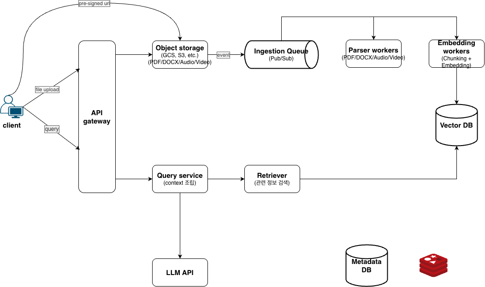

# Week 3 과제: Document-Based AI Agent 시스템 설계 (NotebookLM)

---

## ⒈ 문제 이해 및 설계 범위 확정

**시나리오**

사용자는 PDF, Word, 텍스트, 오디오 등 다양한 형식의 문서를 시스템에 업로드한다. 시스템은 이 문서를 자동으로 처리하여 벡터 형태로 변환 및 저장한 후, 사용자의 자연어 질문에 대해 업로드된 문서 기반으로 답변한다. 사용자는 같은 문서에 대해 여러 질문을 할 수 있으며, 시스템은 이전 대화 맥락을 고려하여 답변을 제공한다.

**예시 시나리오:**
```
1. 사용자가 "machine-learning-paper.pdf" (200MB)를 업로드
2. 시스템이 자동으로 텍스트 추출 및 벡터 임베딩 처리
3. 사용자가 문서에 대해 자연어로 질문
4. 시스템이 관련 문서 청크를 검색하고 LLM으로 답변 생성
5. 사용자가 추가 질문
6. 시스템이 이전 대화 맥락 + 새로운 질문으로 답변
```

## 설계 범위 (In / Out of Scope)

| 포함 (In Scope) | 제외 (Out of Scope) |
| --- | --- |
| 다양한 형식 문서 업로드 | LLM 모델 자체 개발 |
| 문서 파싱 및 텍스트 추출 | 임베딩 모델 개발 |
| 음성-텍스트 변환 (STT) | STT/OCR 엔진 개발 |
| 벡터 임베딩 및 저장 | 완전한 보안 솔루션 개발 |
| 의미론적 문서 검색 | GPU 인프라 구축 |
| 사용자/노트북 관리 | 모델 트레이닝 |
| 실시간 스트리밍 | 모델 파인튜닝 |

## 시스템 구성 전제

- 외부 LLM API 사용 (Claude, Gemini, GPT 등)
- 외부 임베딩 모델 API 사용 (OpenAI Embeddings, Claude 등)
- 객체 스토리지 제공 (AWS S3, GCS 등)
- Vector DB 플랫폼 사용 (Pinecone, Qdrant, Milvus 등)
- 사용자는 인증된 상태
- STT 엔진은 외부 API 사용 가능


## 기능 요구사항

- 다양한 형식의 문서 업로드 (PDF, DOCX, TXT, MP3, MP4)
- 업로드된 문서의 자동 파싱 및 텍스트 추출
- 오디오/비디오의 음성 인식 처리 (STT)
- 벡터 임베딩 변환 및 Vector DB 저장
- Vector DB를 통한 의미론적 문서 검색
- LLM을 이용한 문서 기반 Q&A
- 멀티턴 대화 지원 (채팅 히스토리 관리)
- 노트북(프로젝트) 단위 문서 그룹화
- 사용자별 업로드 문서 관리 및 삭제
- 실시간 스트리밍 응답

## 비기능 요구사항

| 항목 | 목표 |
| --- | --- |
| 첫 응답 시작 시간 | 3초 이내 |
| 문서 처리 완료 시간 | 1GB 기준 15분 이내 |
| 스트리밍 응답 지연 | 평균 1초 이하 |
| 동시 질문 처리 | 수만 개 |
| 동시 문서 업로드 | 수천 개 |
| 최대 단일 파일 크기 | 1GB |
| 가용성 | 99.9% |
| 처리 오류 복구 | 자동 재시도 최대 3회 |
| 데이터 지속성 | 무한 (사용자 삭제 시까지) |

## 대략적 규모 추정

| 항목 | 수치 |
| --- | --- |
| MAU / DAU | 약 1,000,000명 / 약 200,000명 |
| 일일 문서 업로드 | 약 500,000건 |
| 일일 사용자 질문 | 약 2,000,000건 |
| 평균 파일 크기 | 50MB |
| 최대 파일 크기 | 1GB |
| 일일 총 데이터량 | 약 25TB |
| 동시 업로드 사용자 | 약 1,000명 |
| 동시 질문 요청 | 약 10,000명 |
| 피크 시간 질문 증가율 | 평균 대비 3~5배 |
| 평균 처리 시간 | 30초 ~ 5분 (파일 크기별) |
| 멀티턴 대화 깊이 | 평균 3~10턴 |

---

## 2. 개략적 설계안 제시 및 동의 구하기



**핵심 처리 흐름: 1) 파일 업로드** 및 **2) 질문** 두 가지

---

### 파일 업로드 흐름

사용자가 업로드한 문서(PDF, 오디오 등)를 LLM이 이해할 수 있는 벡터 데이터로 변환하여 저장하는 과정.

### Client & API Gateway

* **Client:** 웹 브라우저나 앱 등 유저가 사용하는 인터페이스이다. 대용량 파일 업로드 요청을 보내고, 질문을 던지며, 최종 답변을 화면에 렌더링한다.
* **API Gateway:** 시스템의 진입점(Single Entry Point)이다. 클라이언트의 요청을 받아 인증/인가, 라우팅, Rate Limiting 등을 수행한 후 내부 마이크로서비스로 요청을 넘긴다.

### Object Storage

* **역할:** PDF, DOCX, TXT, MP3 등 사용자가 업로드한 원본 바이너리 파일을 저장하는 저장소이다. (AWS S3, Google Cloud Storage 등)
* **Pre-signed URL 방식:** 클라이언트가 백엔드 서버를 거쳐 오브젝트 스토리지로 파일을 업로드하면, 대용량 파일 처리 시 백엔드 서버의 메모리와 네트워크 대역폭(Bandwidth)이 고갈되어 전체 서비스가 먹통이 될 위험이 있다. 따라서 백엔드로부터 안전한 임시 업로드 주소(Pre-signed URL)를 받아 클라이언트가 클라우드 스토리지로 직접 대용량 파일을 업로드하도록 한다.

### Ingestion Queue

* **역할:** 파일 업로드 이벤트가 발생했을 때 워커(Worker)들에게 이를 알리는 비동기 메시지 브로커이다.
* **필요성:** 무거운 파일 파싱 및 임베딩 작업을 동기 방식으로 처리하면 서버가 다운되거나 클라이언트가 무한정 대기해야 한다. 

큐를 둠으로써 시스템 간의 결합도를 낮추고(Decoupling), 트래픽 급증 시에도 안정적으로 이벤트를 보관할 수 있다.

### Parser Workers

* **역할:** 오브젝트 스토리지에서 원본 파일을 가져와 순수한 텍스트 데이터 추출(Extraction)을 수행하는 엔진이다.
* **상세 작업:** * PDF/DOCX 내부의 텍스트 및 테이블 구조 분석
* 오디오/비디오 파일의 경우 STT(Speech-to-Text) 엔진을 구동하여 음성을 텍스트로 받아쓰기(Transcription) 처리

### Embedding Workers

* **역할:** 파싱된 긴 텍스트를 적절한 크기로 쪼개고(Chunking), 임베딩 모델을 거쳐 고차원의 숫자 배열(Vector)로 변환하는 컴포넌트이다.
* **상세 작업:** 
* 문맥이 끊기지 않도록 일정 두께로 문서를 나누는 Chunking 작업 수행 (Overlap 영역 설정 포함)
* 외부 API 또는 직접 모델을 호출해 텍스트를 고차원 임베딩 벡터로 변환

### Vector DB

* **역할:** 변환된 임베딩 벡터와 함께, 해당 벡터가 문서의 어느 부분에서 나왔는지에 대한 원본 텍스트(Payload/Metadata)를 쌍으로 저장하는 데이터베이스이다. (Pinecone, Milvus, Qdrant, Chroma 등)
* **핵심 기능:** 사용자의 질문 벡터가 들어왔을 때, 다차원 공간에서 가장 거리가 가까운(유사한) 문서 청크들을 빠르게 찾는다.

---

### client의 질문이 처리되는 흐름

사용자의 질문을 받아 관련 지식을 찾고, LLM을 통해 최종 답변을 생성하는 과정이다.

### Query Service

* **역할:** 사용자의 질의(Query) 프로세스를 총괄하는 오케스트레이터이다.
* **상세 작업:** 
* 사용자로부터 질문을 접수
* Retriever에게 관련 문서 검색을 명령
* 유저 정보, 채팅 세션 이력(Chat History)을 RDB/Redis에서 조회하여 이전 대화 맥락과 현재 질문을 병합
* 최종적으로 조립된 컨텍스트(Context)와 프롬프트를 완성하여 LLM API로 전달 및 결과 반환

### Retriever

* **역할:** 사용자의 자연어 질문을 임베딩 벡터로 변환한 뒤, **Vector DB에 쿼리를 날려 가장 관련성 높은 상위 K개의 문서 청크를 뽑아오는 컴포넌트**이다.

### LLM API

* **역할:** 최종 완성된 프롬프트를 기반으로 사용자가 읽기 좋은 자연어 형태의 답변을 생성하는 거대 언어 모델 레이어이다. (Gemini, Claude 등 외부 API 혹은 자체 호스팅 모델)
* **동작 방식:** 쿼리 서비스가 제공한 철저한 가이드라인(`[시스템 지침] + [Retriever가 찾아온 문서 내용] + [사용자 질문]`) 안에서만 답변하도록 제한하여, 환각 현상을 방지한다.

---

> **NotebookLM 구조를 완성하기 위해 추가 해야할 컴포넌트**
> * **Metadata/Relational DB (SQL):** 어떤 유저가 어떤 '노트북(프로젝트 공간)'을 만들었는지, 그 노트북에 어떤 소스 파일들이 업로드되어 연결되어 있는지 등의 **관계형 상태 정보**를 저장한다.
> * **Cache / Session Store (Redis):** "바로 직전에 했던 질문"을 기억하는 멀티턴 대화를 위해, 실시간 **채팅 히스토리**를 빠르게 읽고 쓰기 위한 캐시 레이어다.

## 3. 상세 설계

### 3-1. 토큰 스트리밍 프로토콜 선택

| 프로토콜 | 설명 | 장점 | 단점 | 선택 |
|---|---|---|---|---|
| **SSE** | HTTP 기반 단방향 push | HTTP 표준, 자동 재연결, 구현 단순 | 양방향 불가 | O |
| **WebSocket** | TCP 기반 양방향 통신 | 낮은 지연, 양방향 | **Sticky session 필요** (로드밸런서 세션 유지 복잡), 연결당 메모리 >1MB, 서버 상태 관리 비용 증가 | X |
| **HTTP/2 Streaming** | HTTP/2 Server Push 기반 | 프로토콜 효율성 | 클라이언트 브라우저 지원 한계, 프록시/CDN 호환성 이슈 | X |

---

### 3-2. 파일 업로드 폭주 대응 (S3 Prefix 분산)

**문제:** S3 Prefix당 3,500 RPS 한계
```

예시 : my-bucket/user-{id}-{ts}/filename → Prefix 분산 → 버킷 전체로 3,500 RPS × N
```

**대응:**
1. **Prefix 설계:** `my-bucket/user-{userId}-{timestamp}/{docId}/{filename}`
   - 각 사용자가 독립된 Prefix → S3 내부 파티션 자동 분산
2. **Multipart 업로드:** 100MB 이상은 병렬 업로드 (동시 부분 수: 4개)
3. **클라이언트 백오프:** S3 503 → 지수 백오프 재시도
4. **Rate Limiting:** 사용자당 동시 업로드 최대 2개

---

### 3-3. 파일 업로드 완료 알림

Embedding Worker가 벡터 생성을 완료하면, 사용자에게 질문을 받을 준비가 되었다고 할 수 있다. 따라서 사용자 ui에 파일 업로드 완료 표시를 해야한다.

**구현 (SSE 기반):** Embedding Worker가 작업 완료 후 메세지 브로커에 이벤트를 발행하면 그 이벤트를 감지해서 sse로 완료 응답을 내려준다.

이를 위해서는 **Upload Service** 컴포넌트를 추가해야 하는데, 
파일 업로드 요청을 받고 Pre-signed URL를 내려주는 기능과 한 컴포넌트로 묶을 수 있다.

---
